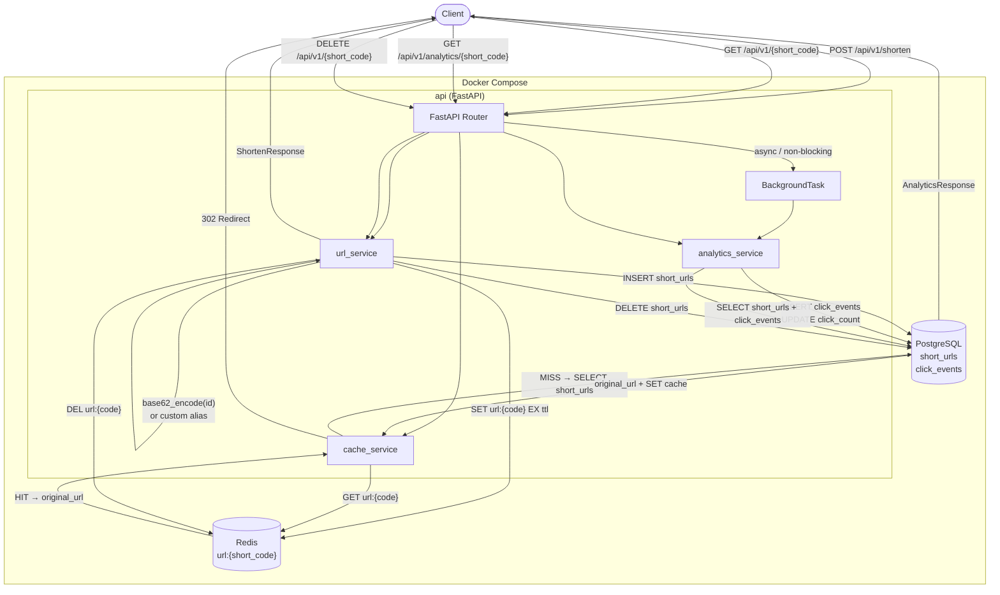

# URL Shortener

A production-grade URL shortening service with async I/O, Redis caching, background analytics, and TTL support.


---

## Overview

This service accepts long URLs and returns a 7-character short code, then issues a `302` redirect when the short code is visited. It is built for production from the ground up: every database call is fully async (SQLAlchemy + asyncpg), redirects are served from Redis with a cache-aside strategy so the database is never hit on warm traffic, and click analytics are recorded via FastAPI `BackgroundTasks` so click recording never adds latency to the redirect response. Custom aliases, per-URL TTLs, and ~3.5 trillion unique codes (62⁷) are supported out of the box.

---

## Architecture



---

## Features

- **URL shortening** — generate a unique 7-character base62 code from an auto-increment primary key; zero collision probability
- **Custom aliases** — supply your own short code (3–16 alphanumeric/`-`/`_` characters)
- **TTL / expiry** — optional `ttl_seconds` causes the URL to expire and return `410 Gone`
- **302 redirects** — cache-aside: Redis is checked first; PostgreSQL is the fallback on a miss
- **Click analytics** — per-click records (timestamp, IP, user-agent, referer) written asynchronously
- **Aggregate analytics** — total click count + full click-event history via a single endpoint
- **Health check** — `GET /health` for load-balancer / orchestrator probes
- **Auto migrations** — Alembic runs `upgrade head` on container start
- **Async I/O throughout** — `asyncpg` + `redis.asyncio`; no blocking calls on the event loop

---

## Tech Stack

| Layer | Technology |
|---|---|
| API framework | FastAPI 0.100+ |
| Async ORM | SQLAlchemy 2 + asyncpg |
| Database | PostgreSQL 16 |
| Cache | Redis 7 |
| Migrations | Alembic |
| Validation | Pydantic v2 |
| Container runtime | Docker + Compose |
| Test suite | pytest + httpx + fakeredis |

---

## Project Structure

```
url-shortner/
├── app/
│   ├── api/
│   │   ├── router.py            # mounts /shorten, /{code}, /analytics
│   │   ├── urls.py              # POST /shorten, GET /{code}, DELETE /{code}
│   │   └── analytics.py        # GET /analytics/{code}
│   ├── services/
│   │   ├── url_service.py       # create / resolve / delete short URLs
│   │   ├── cache_service.py     # get / set / invalidate Redis keys
│   │   ├── analytics_service.py # record_click (background) + get_analytics
│   │   └── shortener.py         # base62_encode + alias validation
│   ├── db/
│   │   ├── models.py            # ShortURL, ClickEvent SQLAlchemy models
│   │   ├── session.py           # async engine + session factory
│   │   └── base.py              # declarative Base
│   ├── schemas/
│   │   ├── url.py               # ShortenRequest / ShortenResponse
│   │   └── analytics.py        # AnalyticsResponse
│   ├── core/exceptions.py       # URLNotFoundError, URLExpiredError, AliasConflictError
│   ├── dependencies.py          # get_db, get_redis FastAPI dependencies
│   ├── config.py                # Settings (pydantic-settings)
│   └── main.py                  # FastAPI app + lifespan
├── alembic/
│   └── versions/0001_initial_schema.py
├── tests/
│   ├── conftest.py              # in-memory SQLite + fakeredis fixtures
│   ├── test_urls.py
│   └── test_analytics.py
├── Dockerfile
├── docker-compose.yml
├── requirements.txt
├── requirements-dev.txt
└── .env.example
```

---

## Quick Start (Docker Compose)

```bash
git clone https://github.com/SankalpSTiwari/url-shortner.git
cd url-shortner

cp .env.example .env          # review defaults, nothing to change for local dev

docker compose up --build
```

The API is available at `http://localhost:8000`.
Migrations (`alembic upgrade head`) run automatically before the server starts.

---

## Local Development (without Docker)

**Prerequisites:** Python 3.11, PostgreSQL 16, Redis 7

```bash
# 1. Create and activate a virtual environment
python3.11 -m venv .venv
source .venv/bin/activate

# 2. Install dependencies
pip install -r requirements.txt

# 3. Configure environment
cp .env.example .env
# Edit DATABASE_URL and REDIS_URL to point at your local services

# 4. Run migrations
alembic upgrade head

# 5. Start the server
uvicorn app.main:app --reload
```

---

## Environment Variables

| Variable | Default | Description |
|---|---|---|
| `DATABASE_URL` | `postgresql+asyncpg://postgres:postgres@db:5432/urlshortener` | Async PostgreSQL connection string |
| `REDIS_URL` | `redis://redis:6379/0` | Redis connection URL |
| `BASE_URL` | `http://localhost:8000` | Public base URL — used to build the `short_url` field in responses |

---

## API Reference

### `POST /api/v1/shorten` — Create a short URL

```bash
curl -X POST http://localhost:8000/api/v1/shorten \
  -H "Content-Type: application/json" \
  -d '{
    "original_url": "https://www.example.com/some/very/long/path",
    "custom_alias": "my-link",
    "ttl_seconds": 86400
  }'
```

`custom_alias` and `ttl_seconds` are optional.

**Response `201`:**
```json
{
  "short_code": "my-link",
  "short_url": "http://localhost:8000/api/v1/my-link",
  "original_url": "https://www.example.com/some/very/long/path",
  "expires_at": "2026-03-18T12:00:00Z",
  "created_at": "2026-03-17T12:00:00Z"
}
```

**Error codes:** `409 Conflict` (alias already taken), `422 Unprocessable Entity` (invalid URL or alias format)

---

### `GET /api/v1/{short_code}` — Redirect

```bash
curl -L http://localhost:8000/api/v1/my-link
```

Returns `302 Found` with `Location` header pointing to the original URL. Click is recorded asynchronously.

**Error codes:** `404 Not Found`, `410 Gone` (URL expired)

---

### `DELETE /api/v1/{short_code}` — Delete a short URL

```bash
curl -X DELETE http://localhost:8000/api/v1/my-link
```

Returns `204 No Content`. Removes the record from PostgreSQL and invalidates the Redis cache entry.

**Error codes:** `404 Not Found`

---

### `GET /api/v1/analytics/{short_code}` — Analytics

```bash
curl http://localhost:8000/api/v1/analytics/my-link
```

**Response `200`:**
```json
{
  "short_code": "my-link",
  "original_url": "https://www.example.com/some/very/long/path",
  "click_count": 42,
  "created_at": "2026-03-17T12:00:00Z",
  "expires_at": null,
  "clicks": [
    {
      "clicked_at": "2026-03-17T12:05:00Z",
      "ip_address": "203.0.113.10",
      "user_agent": "Mozilla/5.0 ...",
      "referer": "https://twitter.com"
    }
  ]
}
```

**Error codes:** `404 Not Found`

---

### `GET /health` — Health check

```bash
curl http://localhost:8000/health
```

**Response `200`:**
```json
{"status": "ok"}
```

---

## Database Schema

### `short_urls`

| Column | Type | Notes |
|---|---|---|
| `id` | `BIGINT` PK | Auto-increment; source for base62 encoding |
| `short_code` | `VARCHAR(16)` UNIQUE | 7-char base62 or custom alias |
| `original_url` | `TEXT` | The destination URL |
| `is_custom` | `BOOLEAN` | `true` when a custom alias was supplied |
| `click_count` | `BIGINT` | Denormalized counter, updated on each click |
| `created_at` | `TIMESTAMPTZ` | Server-set on insert |
| `expires_at` | `TIMESTAMPTZ` | NULL = no expiry |

### `click_events`

| Column | Type | Notes |
|---|---|---|
| `id` | `BIGINT` PK | Auto-increment |
| `short_code` | `VARCHAR(16)` FK | References `short_urls.short_code` ON DELETE CASCADE |
| `clicked_at` | `TIMESTAMPTZ` | Server-set on insert |
| `ip_address` | `VARCHAR(45)` | IPv4 or IPv6 |
| `user_agent` | `TEXT` | From `User-Agent` header |
| `referer` | `TEXT` | From `Referer` header |

---

## Short Code Generation

The encoder converts the auto-increment `id` (an integer) to base62 using the alphabet `0–9A–Za–z`:

```
code = base62_encode(id)   # always padded to MIN_LENGTH = 7
```

- **62⁷ ≈ 3.5 trillion** unique codes before the character count increases
- **Zero collisions** — each `id` is unique by definition; no retry loop is needed
- **Predictable length** — 7 characters for any `id` up to 62⁷−1; grows naturally beyond that
- Custom aliases bypass the encoder entirely and are validated against `/^[a-zA-Z0-9_-]{3,16}$/`

---

## Caching Strategy

The service uses a **cache-aside** (lazy-loading) pattern:

1. **On create** — after inserting into PostgreSQL, call `SET url:{short_code} <json> EX <ttl>`
2. **On redirect** — call `GET url:{short_code}`
   - **HIT** → return `original_url` directly; skip the database
   - **MISS** → query PostgreSQL, then write the result back to Redis
3. **On delete** — call `DEL url:{short_code}` so the next request falls through to a 404

The TTL stored in Redis matches the URL's `expires_at`. URLs with no expiry receive a 24-hour default TTL (`DEFAULT_TTL = 86400`) so Redis never grows unbounded. The `allkeys-lru` eviction policy in the Compose file is a second safety net.

---

## Running Tests

Tests use an in-memory SQLite database and `fakeredis` — no running services required.

```bash
pip install -r requirements-dev.txt
pytest tests/ -v --cov=app
```

---

## Design Decisions

**Base62 over random hash**
Using the auto-increment primary key as the input to the encoder guarantees uniqueness by construction. A random-hash approach requires a uniqueness check (and potential retry) on every insert. Monotonic IDs also produce codes with a predictable, stable length.

**Cache-aside over write-through**
Cache-aside keeps the delete path clean: removing a URL requires only `DEL url:{code}` in Redis — there is no stale entry to reason about. Write-through would require coordinating two writes atomically. Cache-aside also handles Redis downtime gracefully: the application degrades to database-only reads without losing data.

**BackgroundTasks for analytics**
The `302` response is sent before any click-recording database write begins. `record_click` runs in a FastAPI `BackgroundTask`, which executes after the response is sent. This means click latency is entirely invisible to the user making the redirect request, and a slow or failed analytics write never impacts redirect P99.

---

## Deployment Notes (Production)

- Set `BASE_URL` to your public domain, e.g. `https://go.yourdomain.com`
- Remove `--reload` from the `uvicorn` command in `docker-compose.yml` / `Dockerfile`
- Use Docker secrets or a vault (e.g. AWS Secrets Manager) for `DATABASE_URL` and `REDIS_URL` — never commit a production `.env`
- Add a reverse proxy (nginx, Caddy, or an AWS ALB) in front of the API for TLS termination
- Set an explicit `maxmemory` limit in production, e.g. `redis-server --maxmemory 256mb --maxmemory-policy allkeys-lru`
- The `api` service is fully stateless; scale it horizontally behind the load balancer — Redis and PostgreSQL are the only shared-state layer

---

## Verification Checklist

After `docker compose up --build`, run the following smoke test sequence:

```bash
# 1. Health check
curl http://localhost:8000/health

# 2. Shorten a URL (auto-generated code)
curl -X POST http://localhost:8000/api/v1/shorten \
  -H "Content-Type: application/json" \
  -d '{"original_url": "https://www.example.com"}'

# 3. Shorten with a custom alias
curl -X POST http://localhost:8000/api/v1/shorten \
  -H "Content-Type: application/json" \
  -d '{"original_url": "https://www.python.org", "custom_alias": "pyorg"}'

# 4. Follow the redirect (replace 0000001 with the code from step 2)
curl -Lv http://localhost:8000/api/v1/0000001

# 5. Follow the custom alias redirect
curl -Lv http://localhost:8000/api/v1/pyorg

# 6. Check analytics
curl http://localhost:8000/api/v1/analytics/pyorg

# 7. Attempt duplicate alias (expect 409)
curl -X POST http://localhost:8000/api/v1/shorten \
  -H "Content-Type: application/json" \
  -d '{"original_url": "https://www.google.com", "custom_alias": "pyorg"}'

# 8. Shorten with TTL (1 second)
curl -X POST http://localhost:8000/api/v1/shorten \
  -H "Content-Type: application/json" \
  -d '{"original_url": "https://www.example.com/ttl", "ttl_seconds": 1}'

# 9. Wait and hit the expired URL (expect 410)
sleep 2 && curl -v http://localhost:8000/api/v1/<code-from-step-8>

# 10. Delete a URL (expect 204, then 404 on re-access)
curl -X DELETE http://localhost:8000/api/v1/pyorg
curl -v http://localhost:8000/api/v1/pyorg
```
